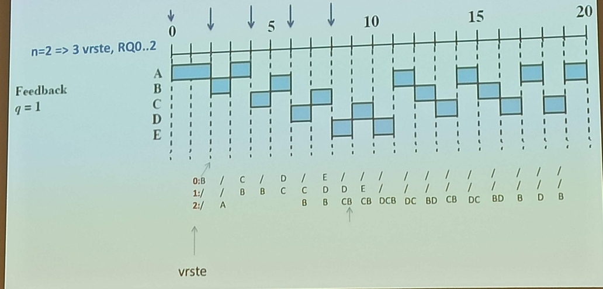

### Razporejanje procesov

- enoprocesorsko, večprocesorsko, realnočasovno razporejanje

Zakaj razporejamo:
- želimo minimizirati odzivni čas (ko klikneš se takoj nekaj zgodi)
- maksimizirati pretočnost (čim več procesov v čim krajšem času)
- da maksimalno izrabimo procesor - ker je I/O počasen, želimo čim bolje izkoristiti procesor (čim manj IDLE časa)

Kakšne razporejevalnike poznamo:
- dolgoročni (procese ustvarjajo)
- srednjeročni (razporejevalniki, ki so namenjeni odstranjevanju procesov (swapping) iz glavnega pomn.) - smo že govorili o njih pri navideznem pomn., pri algoritmih za zamenjavo
- kratkoročne (skrbijo za izvajanje na procesorju) - glavni za enoprocesorsko
- V/I (za dodeljevanje periferije) - z vidika delovanja perifernih enot, rabimo procesu dovoliti dostop do V/I

- 
- long-term pri ustvarjanju procesov
- srednjeročno - poskrbimo za prenose strani med sekundarnim in glavnim pomn.
- short term scheduling = dispatching (dispatcher)
- 
- predstavitev z vrstami:
	- 

Kriteriji za oceno učinkovitosti postopka razporejanja:
- uporabniško usmerjeni - minimizacija odzivnega časa (npr. če je 5 ljudi na sistemu, se želiš počutiti, kot da si sam)
- sistemsko usmerjeni - maksimizirati pretočnost
- -
- kvantitativni
- kvalitativni - npr. napovedljivost (predictability) - ali lahko zagotavljaš enake karakteristike skozi čas, neglede na ostalo dogajanje v sistemu
- -
- preklopen način izvajanja (preamption, preemptive) - trenutno izvajan proces lahko OS prekine in postavi v stanje ready
- nepreklopen način izvajanja - proces, ki je na procesorju, ima monopol do svojega zaključka izvajanja

Algoritmi razporejanja:
- Prioritetno razporejanje:
	- 
	- RQ = ready queue
	- imamo več vrst različne prioritete, vedno izberemo proces z največjo prioriteto
	- preemption ko zmanjka časovne rezine
	- procesi z nižjo prioriteto lahko stradajo:
		- Rešitev: proces naj na podlagi starosti ali zgodovine izvajanja spremeni svojo prioriteto
	- blocked vrsta za čakanje na V/I
	- `top` dinamično prikaže procese, ima zapisano prioriteto in niceness (spremenimo z ukazom `nice`)
- FIFO (first come first serve - FCFS):
	- nepreklopen (če sem prvi prišel, bom prvi končal)
	- 
	- 
	- 
- Kriterij konstantne časovne rezine (round-robbin, RR):
	- časovna enota oz. kvantum (q), na koliko časa se delajo preklopi
	- preklopna različica FIFO
	- kakšno je stanje v vrsti, kdo gre v izvajanje
	- 
	- ko en proces končamo izvajati (poteče kvantum), ga damo na konec vrste, če se še ni končal
	- ko proces pride v vrsto, se postavi na konec vrste
	- če se je proces končal, ga ne dodamo več na vrsto
	- če je vrsta prazna, se naprej izvaja proces, ki je že na procesorju
	- vedno dobimo stopničasto obliko
	- 
	- če je proces daljši od q, se bo razdelil na več delov, sicer se bo naenkrat izvedel
	- če je q dovolj velik, dobimo isti rezultat kot FIFO
- kako biti pravičnejši do procesov ko imamo V/I zahteve - virtual round-robbin:
	- imamo n V/I dogodkov, na katere čakamo, za vsak dogodek imamo blocked vrsto
	- dodamo pomožno (auxiliary) vrsto - ima večjo prioriteto kot ready vrsta, ker so tu procesi, ki so šli predčasno dol iz procesorja, ostalo jim je še nekaj časovnih enot (porabi še preostanek kvantuma)
	- 
	- navidezni round-robbin, ker imamo še pomožno vrsto
- do zdaj smo upoštevali samo značilnosti vrste, nismo gledali izvajalnega časa
- od tu naprej gledamo izvajalni čass
- ocena potrebnega časa za izvajanje ni enostavno pridobljiva
- Najprej najkrajši proces (shortest process next - SPN):
	- nepreklopen
	- iz vrste vzameš tistega, ki ima najkrajšo oceno časa izvajanja in ga izvedeš do konca, ne glede na to, kdaj je prišel v vrsto
	- 
- Najprej tisti z najkrajšim preostankom časa (shortest remaining time, SRT):
	- preklopen algoritem (preklopna različica SPN)
	- z vsakim kvantumom pogledamo, kateri ima najkrajši preostali čas
	- 
	- če je več procesov z istim preostalim časom, gremo po FIFO principu med njimi
- Najprej tisti z največjim odzivnim razmerjem (highest response ratio next, HRRN):
	- nepreklopen
	- 
	- preferira kratke procese, a upošteva staranje pocesov
	- še vedno imamo problem ocene časa izvajanja
	- 
- ker ni enostavno izmeriti časa izvajanja, lahko baziramo na ideji, da nimamo danega časa izvajanja, ampak penaliziramo procese, ki se odvijajo dlje časa; še vedno ni stradanja:
- Razporejanje s povratnim odgovorom (feedback):
	- razporejanje z nižanjem prioritete
	- preklopen način razporejanja
	- ne poznamo pričakovanega časa izvajanja, zato se osredotočimo se na čas, ki ga je proces že preživel v izvajanju
	- ker imamo prioritete, rabimo več vrst
	- kot algoritem razporejanja z več vrstami
	- časovno odvisen, še vedno imamo en procesor
	- 
	- RQi = proces se je i-krat že izvajal na procesorju, manjši kot je x, večjo prioriteto ima
	- koliko vrst imamo - n + 1, indeksi od 0 do n
	- vse vrste do n so FCFS, ker si samo enkrat v njej
	- zadnja vrsta se obnaša po principu RR, ker nimaš vrste z nižjo prioriteto; v tej vrsti imaš procese, ki so se izvajali vsaj n-krat (n-krat ali večkrat)
	- kako se borimo proti stradanju:
		- prvi način (od zgoraj navzdol): Večanje števila časovnih rezin (q (quantum), recimo $2^i$ za RQi) izvajanja:
			- RQ0 ena časovna rezina
			- RQ1 dve časovni rezini
			- RQ2 štiri časovne rezine ...
		- drugi način (od spodaj navzgor): proces promoviramo v višjo vrsto, ko je dolgo časa v RQn vrsti
		- mi bomo delali brez promocije
		- lahko bi z nižanjem prioritete povečevali kvantum
	- ko se proces še ni izvajal, je v RQ0 (se je ničkrat izvajal)
	- primer: n=2 => 3 vrste RQ0, RQ1, RQ2
	- 
	- vedno izbereš nekoga, ki je v vrsti (na vsak kvantum pogledaš v vrsto in če ni prazna, se proces zamenja)
	- vidimo, da se vrsta RQ2 obnaša kot RR
	- 
- na čem bo bazirl benchmark - razmerje od HRRN
	- 
	- $T_r$ = obračalni čas (r = resident, koliko časa si rezidenčen v glavnem pomn.)
	- $T_r / T_s$ = normaliziran obračalni čas (s = service, koliko časa se je dejansko izvajal)